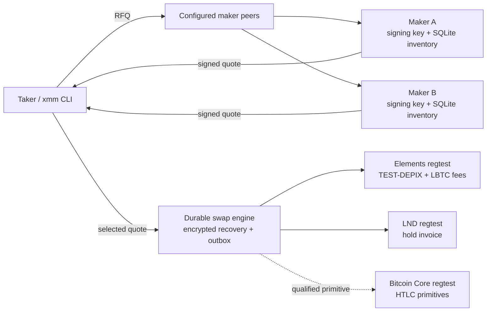
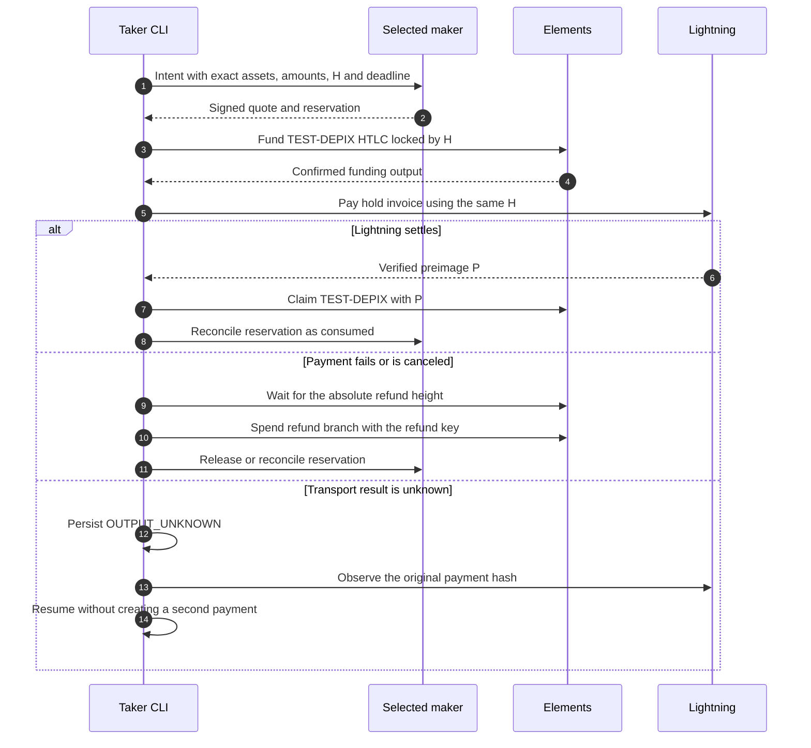
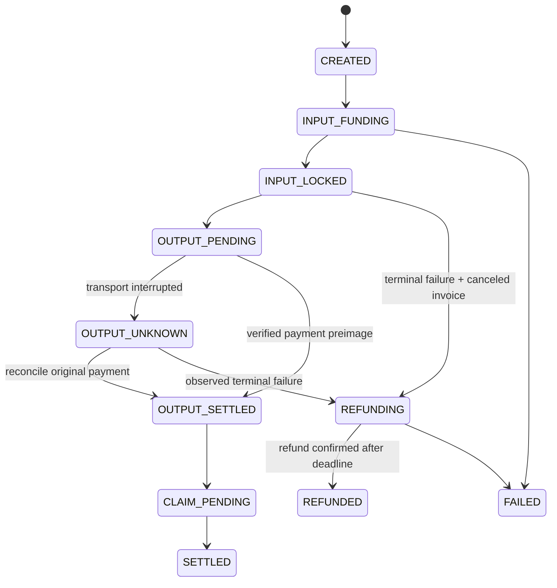
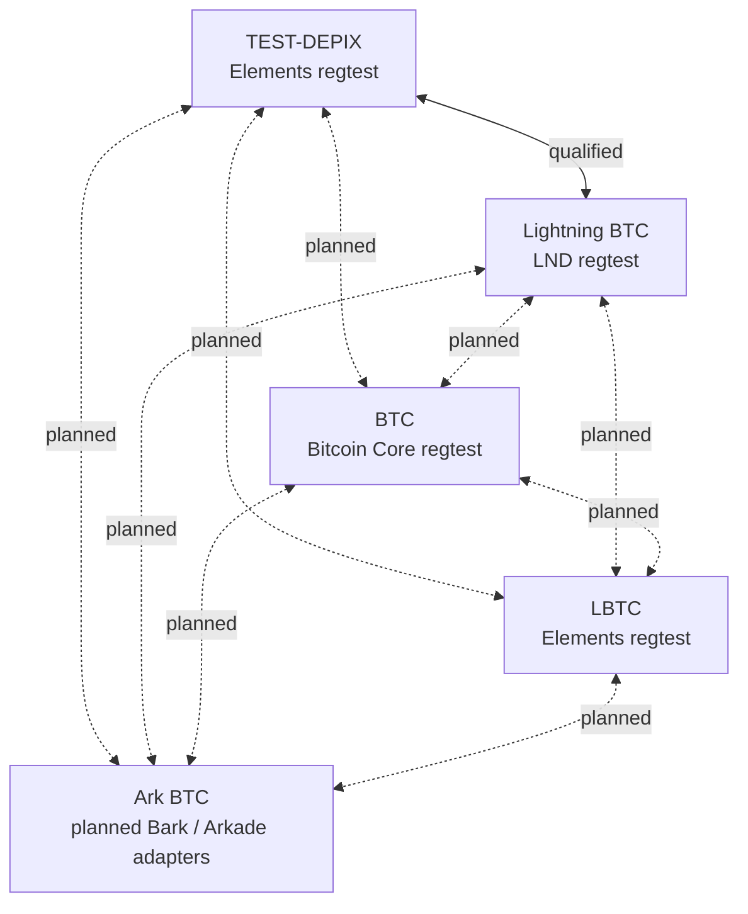
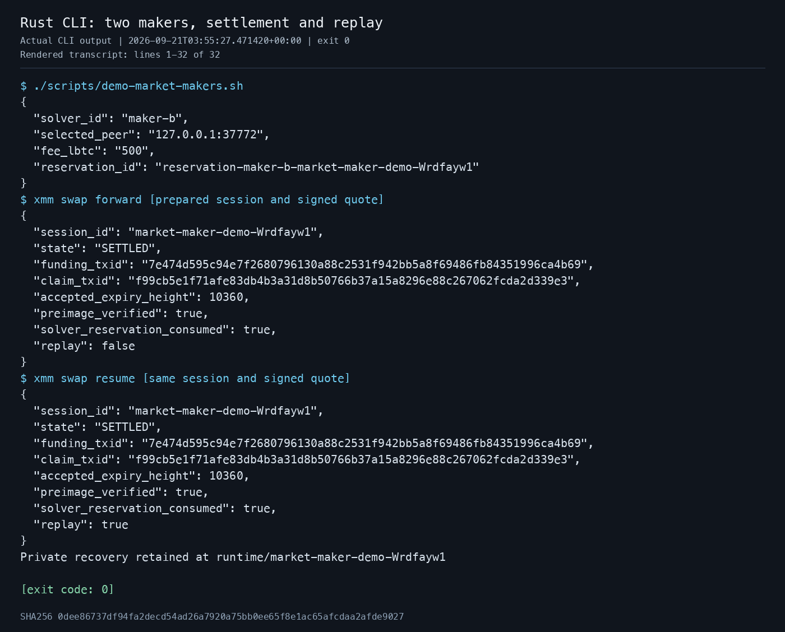
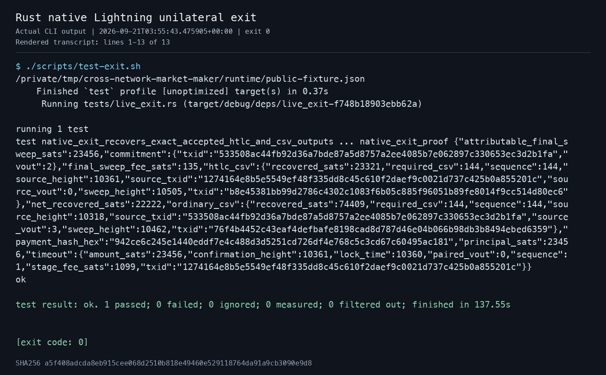

# Cross-network market maker

Native Rust research POC for intent-based market making, signed quotes, durable
swap execution, atomic refunds, and unilateral recovery across Bitcoin-related
networks. The executable is `xmm`.

The qualified environment is **local regtest only**. TEST-DEPIX is a synthetic
Elements asset created by bootstrap. It is not production DEPIX and has no
redemption value. Mainnet and public test networks are disabled.

> Current qualification: TEST-DEPIX ↔ Lightning, Bitcoin and LBTC transaction
> primitives, two independent quote servers, crash-safe replay, timeout refund,
> and native Lightning unilateral exit. Bark, Arkade, Spark, public testnets,
> market pricing, and independently operated maker wallets remain planned work.

## How it fits together



Two local maker processes have independent signing keys and inventory ledgers.
The current settlement harness can access both test participants. Production
decentralization requires each maker to operate its own wallets, observers, and
settlement process.

## Atomic swap flow



The same hash binds both legs. A network timeout is an unknown result, not a
payment failure. Resume always observes the original payment before deciding
whether to claim or refund.

## Recovery paths



Swap refund and native exit are different mechanisms. A swap refund spends the
contract's refund branch after its deadline. A Lightning unilateral exit follows
the commitment transaction, exact HTLC timeout, both CSV delays, and final owned
outputs while the peer remains offline.

## Route catalogue

Five endpoints produce twenty directed routes. Only the two TEST-DEPIX ↔
Lightning directions are enabled by the initial adapter qualification.



Spark would add a sixth endpoint and ten more directed routes. It is deliberately
outside the twenty-route catalogue until its service-provider and unilateral
exit assumptions are independently qualified.

## Start the local stack

Prerequisites: Rust 1.94.1 or compatible newer stable, Docker with Compose,
Python 3, Bash, and curl. The supplied Elements image is pinned to Linux ARM64,
the qualification profile used on Apple Silicon. An x86 host needs a separately
verified Elements binary and its own qualification run.

```bash
git clone https://github.com/HodleHub/cross-network-market-maker.git
cd cross-network-market-maker
cargo build --locked
./scripts/start-regtest.sh
./scripts/bootstrap-regtest.sh
./scripts/status-regtest.sh
```

The stack creates Bitcoin Core, Elements, and two LND nodes with dedicated
volumes and loopback-only API ports. It starts from local genesis and does not
download Bitcoin history. Docker images and the Rust compiler cache still use
disk space.

Inspect the twenty-entry route catalogue:

```bash
./target/debug/xmm routes
```

This catalog command has no TEST-DEPIX asset hash argument, so it reports the
routes as unsupported. The `rfq` and swap commands below load the locally issued
asset hash and enable only the qualified TEST-DEPIX ↔ Lightning pair.

## Run two market makers from the CLI

The following commands are the complete local example. Private keys, SQLite
files, and recovery material remain under the ignored `runtime/` directory.

Create two independent maker identities. Key generation refuses to overwrite an
existing file; run these commands once, then reuse the same keys and ledgers on
later sessions. To start with new identities, choose another maker directory.

```bash
umask 077
mkdir -p runtime/makers/a runtime/makers/b

./target/debug/xmm solver keygen \
  --out runtime/makers/a/signing.key \
  > runtime/makers/a/public.json

./target/debug/xmm solver keygen \
  --out runtime/makers/b/signing.key \
  > runtime/makers/b/public.json
```

Start maker A in one terminal:

```bash
XMM_TEST_ASSET="$(python3 -c 'import json; print(json.load(open("runtime/public-fixture.json"))["elements"]["testDepixAssetId"])')"

./target/debug/xmm solver serve \
  --bind 127.0.0.1:37771 \
  --solver-id maker-a \
  --key-id key-a \
  --key-file runtime/makers/a/signing.key \
  --database runtime/makers/a/ledger.sqlite \
  --asset-hash "$XMM_TEST_ASSET" \
  --inventory-asset-id BTC \
  --inventory-amount 1000000 \
  --rate-numerator 1 \
  --rate-denominator 1 \
  --fee-lbtc 1000
```

Start maker B in another terminal. It offers a lower signed fee, so the client
should select it:

```bash
XMM_TEST_ASSET="$(python3 -c 'import json; print(json.load(open("runtime/public-fixture.json"))["elements"]["testDepixAssetId"])')"

./target/debug/xmm solver serve \
  --bind 127.0.0.1:37772 \
  --solver-id maker-b \
  --key-id key-b \
  --key-file runtime/makers/b/signing.key \
  --database runtime/makers/b/ledger.sqlite \
  --asset-hash "$XMM_TEST_ASSET" \
  --inventory-asset-id BTC \
  --inventory-amount 1000000 \
  --rate-numerator 1 \
  --rate-denominator 1 \
  --fee-lbtc 500
```

## Prepare an intent and request quotes

Run these commands in a third terminal:

```bash
umask 077
XMM_TEST_ASSET="$(python3 -c 'import json; print(json.load(open("runtime/public-fixture.json"))["elements"]["testDepixAssetId"])')"
mkdir -p runtime/readme
XMM_SESSION_DIR="$(mktemp -d runtime/readme/session-XXXXXXXX)"
XMM_SESSION="$(basename "$XMM_SESSION_DIR")"

XMM_KEY_A="$(python3 -c 'import json; print(json.load(open("runtime/makers/a/public.json"))["public_key"])')"
XMM_KEY_B="$(python3 -c 'import json; print(json.load(open("runtime/makers/b/public.json"))["public_key"])')"

./target/debug/xmm swap prepare \
  --session "$XMM_SESSION" \
  --intent-out "$XMM_SESSION_DIR/intent.json" \
  --database "$XMM_SESSION_DIR/client.sqlite" \
  --recovery-key "$XMM_SESSION_DIR/recovery.key" \
  --asset-hash "$XMM_TEST_ASSET" \
  --amount-in 1000 \
  --amount-out 1000 \
  --fee-limit-lbtc 2000 \
  --fee-sats 500 \
  --receiver-url https://127.0.0.1:29082 \
  --receiver-cert runtime/lnd-bob/tls.cert \
  --receiver-macaroon runtime/lnd-bob/admin.macaroon

./target/debug/xmm rfq \
  --peer 127.0.0.1:37771,127.0.0.1:37772 \
  --intent "$XMM_SESSION_DIR/intent.json" \
  --pinned-key "key-a=$XMM_KEY_A,key-b=$XMM_KEY_B" \
  --asset-hash "$XMM_TEST_ASSET" \
  --reserve \
  --out "$XMM_SESSION_DIR/selected.json"
```

The selected quote is signed and bound to the exact intent, asset hash, invoice,
amounts, keys, fee cap, nonce, and deadline. With the example fees, maker B wins.

## Settle and resume without duplicate payment

Keep the variables from the previous section and run:

```bash
XMM_SWAP_ARGS=(
  --intent "$XMM_SESSION_DIR/intent.json"
  --quote "$XMM_SESSION_DIR/selected.json"
  --database "$XMM_SESSION_DIR/client.sqlite"
  --recovery-key "$XMM_SESSION_DIR/recovery.key"
  --pinned-key "key-a=$XMM_KEY_A,key-b=$XMM_KEY_B"
  --asset-hash "$XMM_TEST_ASSET"
  --solver-database runtime/makers/b/ledger.sqlite
  --receiver-url https://127.0.0.1:29082
  --receiver-cert runtime/lnd-bob/tls.cert
  --receiver-macaroon runtime/lnd-bob/admin.macaroon
  --payer-url https://127.0.0.1:29081
  --payer-cert runtime/lnd-alice/tls.cert
  --payer-macaroon runtime/lnd-alice/admin.macaroon
  --fee-sats 500
)

./target/debug/xmm swap forward "${XMM_SWAP_ARGS[@]}"
./target/debug/xmm swap resume "${XMM_SWAP_ARGS[@]}"
./target/debug/xmm swap status \
  --database "$XMM_SESSION_DIR/client.sqlite" \
  --swap-id "$XMM_SESSION"
```

`forward` reports `SETTLED`. `resume` returns the same funding and claim txids
with `replay: true`; it does not create another Lightning payment.

As an alternative to the manual three-terminal flow, the repository includes a
one-command version. Stop the manual maker processes with `Ctrl-C` before
running it because the demo uses the same ports, 37771 and 37772:

```bash
./scripts/demo-market-makers.sh
```

Actual output from that command:



## Test refunds and unilateral exit

Run the seven regular real-node tests first, then the destructive-to-the-test-
channel native exit test:

```bash
cargo fmt --check
cargo clippy --locked --all-targets -- -D warnings
cargo test --locked
./scripts/test-regtest.sh
CROSS_NETWORK_MARKET_MAKER_EXIT_QUALIFIED=1 ./scripts/test-exit.sh
```

The regular suite includes Bitcoin claim/refund, Elements TEST-DEPIX
claim/refund, LBTC-as-payment, LND settle/cancel, wrong certificate rejection,
forward/reverse swaps, crash replay, and failed-payment refund.

The unilateral-exit test takes the receiving peer offline, force-closes the
selected channel, identifies the exact hash-linked timeout transaction, waits
for both 144-block CSV delays, and verifies the final outputs belong to the
local LND wallet.



## Validation results

| Suite | Result |
| --- | --- |
| Protocol, persistence, parsing, and safety | 34 passed |
| Regular real-node regtest suite | 7 passed, 0 ignored |
| Native Lightning unilateral exit | 1 passed, 0 ignored |
| Secret scan of publication files and Git history | No leaks found |

Each PNG under `evidence/` is rendered from the matching real Rust command
transcript. The adjacent JSON records the command, UTC timestamp, exit code,
source commit, and SHA-256 of the complete transcript.

Reproduce the publication secret scans with:

```bash
gitleaks dir . --redact --no-banner
gitleaks git . --redact --no-banner
```

## Trust boundaries and current limits

- Fixed rational rates are deterministic test prices, not a BRL/BTC market feed.
- The quoted maker fee is used for negotiation and ranking; realized-spread
  accounting and a dedicated maker-fee output are future work.
- A declared inventory balance is bookkeeping. Production makers must reconcile
  it against their own wallet, channel capacity, pending HTLCs, and reservations.
- Liquid still depends on its federation and the asset issuer. DEPIX redemption
  is not made unilateral by this swap protocol.
- Exact TLS certificate pinning is appropriate for this isolated fixture. It is
  not a general public-network certificate policy.
- Ark/Bark/Arkade and Spark need independent conditional-transfer and exit
  qualification before their routes can be enabled.

For the full roadmap and protocol details, see the
[implementation plan](docs/implementationPlan.md),
[operator tutorial](docs/marketMakerTutorial.md), and
[protocol notes](api-contract.md).

## Stop and preserve recovery

```bash
./scripts/stop-regtest.sh
```

This stops only this repository's containers and preserves the dedicated Docker
volumes and ignored `runtime/` directory. Keep runtime recovery keys and node
backups private. Deleting either can make an unfinished swap unrecoverable.
