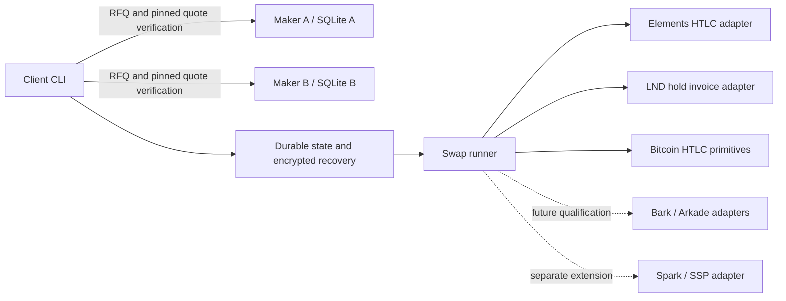

# Implementation plan

## Objective and acceptance criteria

Build an independent Rust research implementation of intent-based cross-network
market making. A client requests an exact transfer, independent makers return
signed quotes, the client verifies and reserves one quote, and adapters execute
the conditional transfers. Every externally visible effect must be recoverable
after a process restart.

The first qualification environment is an isolated local regtest. TEST-DEPIX is
a newly issued Elements asset with no monetary value, redemption promise, or
connection to the production DEPIX issuer. The initial implementation must:

1. Discover two explicitly configured local makers with independent keys and
   SQLite ledgers, verify their quotes against pinned keys, and reserve the
   selected maker's destination inventory.
2. Build and sign Bitcoin and explicit Elements HTLC transactions in Rust.
3. Settle TEST-DEPIX to Lightning and exercise the reverse conditional transfer
   against real Elements and LND nodes.
4. Preserve the same hash, contract, signed transaction, and payment identity
   across interruptions. A network timeout is an unknown result, not failure.
5. Demonstrate timeout refunds and a separate Lightning native unilateral exit.
6. Publish reproducible commands and sanitized evidence containing real node
   observations, with no secrets or runtime databases in Git.

The release evidence and tutorial describe which of these acceptance checks
passed. A route entry, trait, or unit test alone does not qualify a settlement
route.

## Architecture

The POC uses a local harness with access to both test participants. Its two RFQ
processes demonstrate independent identities and reservation ledgers. They do
not yet constitute independently operated, permissionless settlement daemons.
Moving to that architecture requires splitting key custody, wallets, observers,
and message delivery by participant.

Amounts use integer atomic units. Asset identity includes the network and the
issued asset hash. A TEST-DEPIX quantity cannot be compared directly with BTC
satoshis without an explicit price. Rates in this POC are fixed rational test
rates, not a BRL/BTC market price feed.

## Route matrix and qualification order

Five endpoints produce `5 × 4 = 20` directed routes. Each bidirectional row below
represents two independent qualifications; success in one direction does not
qualify its reverse.

| Pair | Planned settlement mechanism | Qualification stage |
| --- | --- | --- |
| TEST-DEPIX ↔ Lightning | Explicit asset HTLC and same-hash Lightning hold payment | Initial POC |
| TEST-DEPIX ↔ Bitcoin | Elements HTLC and Bitcoin HTLC | Chain-pair extension |
| TEST-DEPIX ↔ LBTC | Same-chain asset exchange; prefer a single atomic Elements transaction where suitable | Liquid extension |
| Lightning ↔ Bitcoin | Hold payment and Bitcoin HTLC | Chain-pair extension |
| Lightning ↔ LBTC | Hold payment and Elements policy-asset HTLC | Liquid extension |
| Bitcoin ↔ LBTC | Two chain HTLCs | Chain-pair extension |
| TEST-DEPIX ↔ Ark BTC | Elements HTLC and qualified Ark conditional transfer | Ark extension |
| Lightning ↔ Ark BTC | Lightning HTLC and qualified Ark conditional transfer | Ark extension |
| Bitcoin ↔ Ark BTC | Bitcoin HTLC and qualified Ark conditional transfer | Ark extension |
| LBTC ↔ Ark BTC | Elements HTLC and qualified Ark conditional transfer | Ark extension |

`Ark BTC` is a planning endpoint, not an interchangeable production API. Bark
and Arkade require separate adapter versions and evidence. Spark adds a sixth
endpoint and another ten directed routes if adopted; it is not included in the
twenty-route catalogue.

## Phase 1 — Native Rust baseline

Implement canonical amount parsing, endpoint identity, signed quotes, pinned
maker identities, bounded local transport, durable reservations, and explicit
state transitions. Store recovery keys separately from encrypted session files.
Persist a deterministic signed transaction outbox before broadcasting.

Implement node adapters with explicit network checks, exact invoice/hash/amount
validation, conservative timeout checks, and sanitized evidence types. Use real
Bitcoin, Elements, and LND regtest nodes for integration tests. Keep pure script
and protocol tests available without Docker.

The regular live suite runs serially. The destructive-to-the-test-channel native
exit suite runs last and requires an explicit opt-in. Neither suite is allowed
to pass by silently returning early when prerequisites are missing.

## Phase 2 — Independent maker execution

Give each maker its own Lightning payer and Liquid wallet. Separate the client
refund key from the maker claim key. Replace shared local database access with
authenticated, versioned messages and independent observation by each party.
Do not let a client message consume or release inventory without the maker's
own settlement observations.

Add acceptance acknowledgements, expiry-aware reservation cleanup, queue limits,
and durable jobs for reconciliation. Exercise dropped responses, duplicate
requests, process termination, quote replay, stale tips, and conflicting spends.
Pass conditions are one funding effect, at most one payment identity, and one
terminal ledger outcome after restart.

## Phase 3 — Additional non-Ark routes

Connect already qualified Bitcoin/Elements transaction primitives to the common
runner one pair and one direction at a time. For every route verify the exact
asset and output script, confirmation policy, destination ownership, fee asset,
preimage linkage, and independently spendable refund path.

Prefer a single jointly signed Elements transaction for a same-chain atomic
asset exchange when its signing protocol satisfies both participants' limits.
An HTLC route remains a separate mechanism and requires its own timeout tests.
Do not infer LBTC support merely from TEST-DEPIX support: the payment asset can
equal the fee asset, which changes UTXO selection and accounting.

## Phase 4 — Bark first, Arkade separately

[Bark](https://gitlab.com/ark-bitcoin/bark) is Second's Rust implementation of Ark.
[Arkade's intent solver](https://github.com/arkade-os/intent-solver) is a useful
reference for RFQ and adapter separation. Its API and exit behavior must not be
assumed to be Bark's API.

Pin the selected Bark release and run its server/client test environment. Before
enabling a route, prove all of the following against that release:

- The conditional output binds the same payment hash and the intended keys.
- The recipient can distinguish an accepted transfer from a spendable one.
- Refund timing remains safe across VTXO expiry, refresh, and on-chain exit.
- A user holding the required transaction package can recover with the Ark
  service offline, including fee funding and all relative timelocks.
- Restart, conflicting spends, service refusal, and a late preimage have
  explicit outcomes and bounded capital exposure.

If a required conditional transfer primitive is unavailable, leave the adapter
disabled. Do not replace it with a custodial credit while labeling the result an
atomic swap. Repeat qualification independently for an Arkade adapter.

## Phase 5 — Discovery, pricing, and inventory

Add signed maker advertisements containing protocol version, supported adapter
versions, asset hashes, lot limits, expiry, and transport addresses. Use multiple
independent discovery relays and retain direct pinned peers as a fallback.
Discovery locates offers; it never attests to payment completion or authorizes
funding. Verify signatures, network identity, quote limits, and contracts locally.

Introduce a price source, explicit spread, routing and miner fee budgets,
inventory limits per asset/network, reservation expiry, and volatility limits.
Prices need integer rounding rules and a bounded validity window. Rebalancing is
a separately costed activity; a maker must already hold the destination liquidity
needed to honor accepted quotes.

The next decentralization acceptance test runs makers on different machines,
removes one maker and one discovery relay mid-request, and completes or refunds
without either party depending on a central order database.

## Phase 6 — Spark and public test networks

[open-ssp](https://github.com/benthecarman/open-ssp) provides a Rust Spark service
provider reference. Treat Spark as another independently qualified adapter,
including its operator assumptions, transfer finality, unilateral exit material,
and cross-network timeout behavior. It is not a drop-in Ark backend.

Only after regtest qualification, add named public test networks with separate
configuration, credentials, wallets, and small limits. A network without a
test DEPIX asset uses a clearly named synthetic asset. Never substitute a
mainnet issuer's asset identifier into a test harness.

## Atomicity, refund, and unilateral exit

A successful cross-network swap links both legs to one hash commitment and
validated timeout ordering. A failed swap returns the original locked asset
through its refund branch after the deadline, subject to fees, chain progress,
timely monitoring, and access to the required keys and recovery data. It does
not reverse an already settled payment or refund all network fees.

Cross-chain heights are not comparable. Convert each remaining interval using
the route's conservative block-time policy and require a safety margin. The
regtest policy is a test policy, not a production finality guarantee.

A swap timeout refund is distinct from a native unilateral exit. Lightning exit
requires commitment/HTLC resolution and CSV maturity. An Ark exit requires the
selected protocol's exit transaction package and its own timelocks. Liquid
settlement does not eliminate federation or asset-issuer dependencies, and
holding TEST-DEPIX/DEPIX does not create a unilateral BRL redemption mechanism.

## Storage and operational constraints

Regtest starts from a local genesis and mines only the blocks needed by tests.
It does not download Bitcoin's historical chain. The stack still needs node
binaries, Docker images/volumes, and Rust build dependencies.

For later public-network work, choose a separately operated node or investigate
a pruned backend compatible with every required wallet, index, historical
transaction lookup, and exit observer. This POC uses `txindex`; replacing it
with a pruned node is not a configuration-only qualified change. A remote RPC
backend changes the observation trust and availability assumptions and needs a
new transport policy; current node clients intentionally accept loopback only.

## Completion gates

Every enabled route needs a reproducible success case, timeout/refund case,
crash/replay case, hostile input case, exact asset/amount accounting, and native
exit evidence where applicable. Before wider use, review participant custody,
the protocol state machine, fee handling, and cryptography independently. The
current repository is a regtest research POC, not a production funds service.
